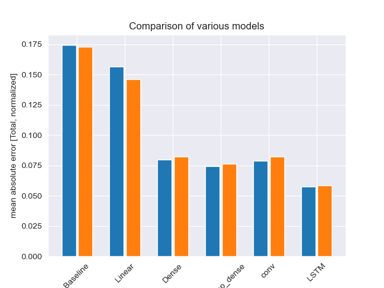

# Time series forecasting using Deep Neural Net models

## Code
- [Complex models](https://github.com/ciCciC/forecastingUsingDNNets/blob/main/notebooks/complex_models_energy.ipynb)
  - Data:
    - [American Energy Power (Hourly Energy Consumption Data)](https://www.kaggle.com/datasets/robikscube/hourly-energy-consumption?resource=download&select=AEP_hourly.csv)
  - Models:
    - Baseline
    - Linear Model
    - Deep Dense Neural Network
    - Convolution Neural Network
    - Recurrent Neural Network with Long-Short Term Memory (RNN-LSTM)
  - Evaluation
    - [Validation and Test Mean Absolute Error (MAE)](https://github.com/ciCciC/forecastingUsingDNNets/blob/main/notebooks/comparison.png)
- [Prophet (Meta)](https://github.com/ciCciC/forecastingUsingDNNets/blob/main/notebooks/r)

# Evaluation

# Prerequisite
- pip install numpy pandas matplotlib seaborn scikit-learn neuralprophet jupyter
- conda install geopandas prophet

- Tensorflow M1 -> https://developer.apple.com/metal/tensorflow-plugin
