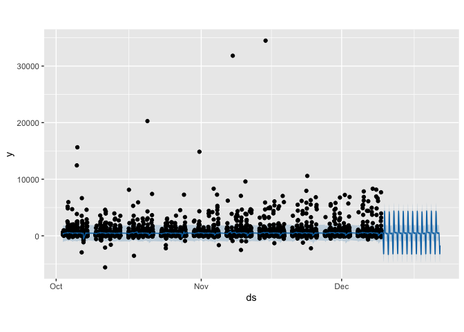
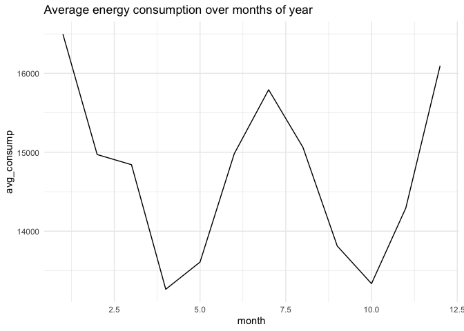
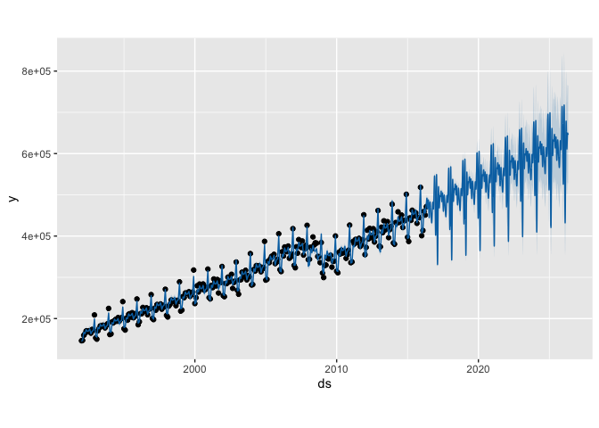

Applying Prophet for time series forecasting
================

``` r
#install.packages('prophet')
```

## Dependencies

``` r
library(prophet)
```

    ## Loading required package: Rcpp

    ## Loading required package: rlang

``` r
library(lubridate)
```

    ## 
    ## Attaching package: 'lubridate'

    ## The following objects are masked from 'package:base':
    ## 
    ##     date, intersect, setdiff, union

``` r
library(tidyverse)
```

    ## ── Attaching packages ─────────────────────────────────────── tidyverse 1.3.1 ──

    ## ✓ ggplot2 3.3.5     ✓ purrr   0.3.4
    ## ✓ tibble  3.1.5     ✓ dplyr   1.0.7
    ## ✓ tidyr   1.1.4     ✓ stringr 1.4.0
    ## ✓ readr   2.0.2     ✓ forcats 0.5.1

    ## ── Conflicts ────────────────────────────────────────── tidyverse_conflicts() ──
    ## x purrr::%@%()             masks rlang::%@%()
    ## x purrr::as_function()     masks rlang::as_function()
    ## x lubridate::as.difftime() masks base::as.difftime()
    ## x lubridate::date()        masks base::date()
    ## x dplyr::filter()          masks stats::filter()
    ## x purrr::flatten()         masks rlang::flatten()
    ## x purrr::flatten_chr()     masks rlang::flatten_chr()
    ## x purrr::flatten_dbl()     masks rlang::flatten_dbl()
    ## x purrr::flatten_int()     masks rlang::flatten_int()
    ## x purrr::flatten_lgl()     masks rlang::flatten_lgl()
    ## x purrr::flatten_raw()     masks rlang::flatten_raw()
    ## x lubridate::intersect()   masks base::intersect()
    ## x purrr::invoke()          masks rlang::invoke()
    ## x dplyr::lag()             masks stats::lag()
    ## x purrr::list_along()      masks rlang::list_along()
    ## x purrr::modify()          masks rlang::modify()
    ## x purrr::prepend()         masks rlang::prepend()
    ## x lubridate::setdiff()     masks base::setdiff()
    ## x purrr::splice()          masks rlang::splice()
    ## x lubridate::union()       masks base::union()

# Sub-daily time series forecasting

## Loading data

``` r
df_raw = read_csv('../../data/e_commerce_uk.csv')
```

    ## Rows: 541909 Columns: 8

    ## ── Column specification ────────────────────────────────────────────────────────
    ## Delimiter: ","
    ## chr (5): InvoiceNo, StockCode, Description, InvoiceDate, Country
    ## dbl (3): Quantity, UnitPrice, CustomerID

    ## 
    ## ℹ Use `spec()` to retrieve the full column specification for this data.
    ## ℹ Specify the column types or set `show_col_types = FALSE` to quiet this message.

## Data mutation to have appropiate structure

``` r
# %Y-%m-%d %H:%M:%S

df_mutated = df_raw %>% mutate(y = Quantity * UnitPrice, InvoiceDate=mdy_hm(InvoiceDate)) %>% select(InvoiceDate, y)

df_mutated = df_mutated %>% rename(ds=InvoiceDate)
df_mutated %>% head()
```

    ## # A tibble: 6 × 2
    ##   ds                      y
    ##   <dttm>              <dbl>
    ## 1 2010-12-01 08:26:00  15.3
    ## 2 2010-12-01 08:26:00  20.3
    ## 3 2010-12-01 08:26:00  22  
    ## 4 2010-12-01 08:26:00  20.3
    ## 5 2010-12-01 08:26:00  20.3
    ## 6 2010-12-01 08:26:00  15.3

## Detecting outliers using Z-score

``` r
?plot
```

    ## Help on topic 'plot' was found in the following packages:
    ## 
    ##   Package               Library
    ##   graphics              /Library/Frameworks/R.framework/Versions/4.1-arm64/Resources/library
    ##   base                  /Library/Frameworks/R.framework/Resources/library
    ## 
    ## 
    ## Using the first match ...

``` r
z_scores <- abs((df_mutated$y-mean(df_mutated$y))/sd(df_mutated$y))
```

``` r
no_outliers = z_scores < 3

df = df_mutated %>% filter(no_outliers)
length(df_mutated$y) - length(df$y)
```

    ## [1] 403

## Subsetting dataframe to analyse observations starting from 2011-10

``` r
slice = ymd_hm('2011-10-01 00:00')

df = df %>% 
  filter(ds > slice) %>% 
  mutate(h = strptime(ds, '%Y-%m-%d %H:%M')) %>% 
  select(h, y) %>% 
  group_by(h) %>% 
  summarise(y = sum(y)) %>% 
  mutate(h = as.character(h)) %>% 
  rename(ds = h)

nrow(df)
```

    ## [1] 6260

## General sales

``` r
df %>% 
  mutate(response=y, day=ymd_hms(ds)) %>% 
  ggplot(aes(x=day, y=response)) + 
  geom_line(aes(color=response)) + 
  labs(title='General Sales', x='Date', y='Sale', color='Sale') +
  theme_minimal()
```

<!-- -->

## Model creation

``` r
m = prophet(df, changepoint.prior.scale = 0.01)
```

    ## Disabling yearly seasonality. Run prophet with yearly.seasonality=TRUE to override this.

``` r
future = make_future_dataframe(m, periods=300, freq = 60*60)

forecast = predict(m, future)
tail(forecast[c('ds', 'yhat', 'yhat_lower', 'yhat_upper')])
```

    ##                       ds       yhat yhat_lower yhat_upper
    ## 6555 2011-12-21 19:50:00   193.0210  -1197.904  1519.2096
    ## 6556 2011-12-21 20:50:00  -732.5828  -2184.628   619.1318
    ## 6557 2011-12-21 21:50:00 -2085.8353  -3468.282  -805.8146
    ## 6558 2011-12-21 22:50:00 -3187.1641  -4524.714 -1699.3767
    ## 6559 2011-12-21 23:50:00 -3188.7353  -4656.044 -1798.9209
    ## 6560 2011-12-22 00:50:00 -1706.5524  -3053.410  -302.3190

``` r
plot(m, forecast)
```

<!-- -->

``` r
prophet_plot_components(m, forecast)
```

<!-- -->

## Interactive graph

``` r
#dyplot.prophet(m, forecast)
```

# Monthly time series forecasting

## Loading data

``` r
df_raw = read_csv('../../data/example_retail_sales.csv')
```

    ## Rows: 293 Columns: 2

    ## ── Column specification ────────────────────────────────────────────────────────
    ## Delimiter: ","
    ## dbl  (1): y
    ## date (1): ds

    ## 
    ## ℹ Use `spec()` to retrieve the full column specification for this data.
    ## ℹ Specify the column types or set `show_col_types = FALSE` to quiet this message.

``` r
df_raw %>% head()
```

    ## # A tibble: 6 × 2
    ##   ds              y
    ##   <date>      <dbl>
    ## 1 1992-01-01 146376
    ## 2 1992-02-01 147079
    ## 3 1992-03-01 159336
    ## 4 1992-04-01 163669
    ## 5 1992-05-01 170068
    ## 6 1992-06-01 168663

## Model creation

``` r
m = prophet(df_raw, seasonality.mode = 'multiplicative')
```

    ## Disabling weekly seasonality. Run prophet with weekly.seasonality=TRUE to override this.

    ## Disabling daily seasonality. Run prophet with daily.seasonality=TRUE to override this.

``` r
n_10_years = 3652
future = make_future_dataframe(m, periods=n_10_years)

forecast = predict(m, future)

plot(m, forecast)
```

<!-- -->

## Interactive graph

``` r
#dyplot.prophet(m, forecast)
```
