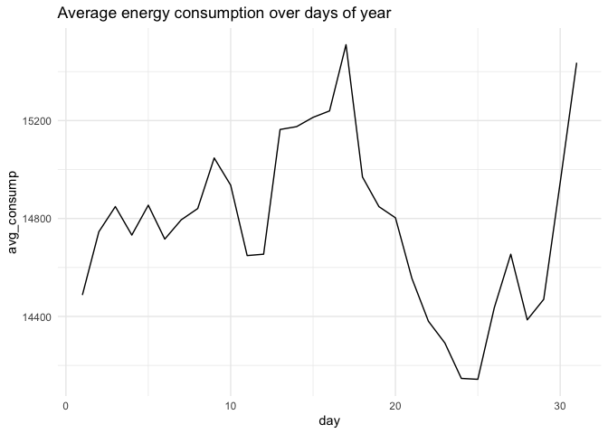
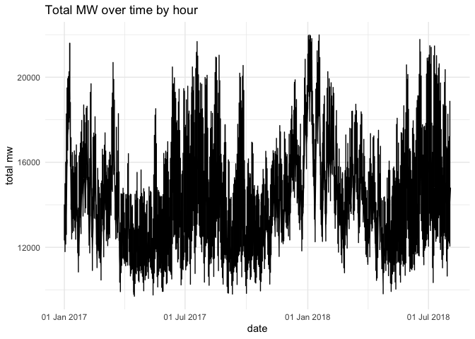

Applying Prophet for time series forecasting for Energy Consumption
================

``` r
#install.packages('prophet')
```

## Dependencies

``` r
library(prophet)
```

    ## Loading required package: Rcpp

    ## Loading required package: rlang

``` r
library(lubridate)
```

    ## 
    ## Attaching package: 'lubridate'

    ## The following objects are masked from 'package:base':
    ## 
    ##     date, intersect, setdiff, union

``` r
library(tidyverse)
```

    ## ── Attaching packages ─────────────────────────────────────── tidyverse 1.3.1 ──

    ## ✓ ggplot2 3.3.5     ✓ purrr   0.3.4
    ## ✓ tibble  3.1.5     ✓ dplyr   1.0.7
    ## ✓ tidyr   1.1.4     ✓ stringr 1.4.0
    ## ✓ readr   2.0.2     ✓ forcats 0.5.1

    ## ── Conflicts ────────────────────────────────────────── tidyverse_conflicts() ──
    ## x purrr::%@%()             masks rlang::%@%()
    ## x purrr::as_function()     masks rlang::as_function()
    ## x lubridate::as.difftime() masks base::as.difftime()
    ## x lubridate::date()        masks base::date()
    ## x dplyr::filter()          masks stats::filter()
    ## x purrr::flatten()         masks rlang::flatten()
    ## x purrr::flatten_chr()     masks rlang::flatten_chr()
    ## x purrr::flatten_dbl()     masks rlang::flatten_dbl()
    ## x purrr::flatten_int()     masks rlang::flatten_int()
    ## x purrr::flatten_lgl()     masks rlang::flatten_lgl()
    ## x purrr::flatten_raw()     masks rlang::flatten_raw()
    ## x lubridate::intersect()   masks base::intersect()
    ## x purrr::invoke()          masks rlang::invoke()
    ## x dplyr::lag()             masks stats::lag()
    ## x purrr::list_along()      masks rlang::list_along()
    ## x purrr::modify()          masks rlang::modify()
    ## x purrr::prepend()         masks rlang::prepend()
    ## x lubridate::setdiff()     masks base::setdiff()
    ## x purrr::splice()          masks rlang::splice()
    ## x lubridate::union()       masks base::union()

# Sub-daily time series forecasting

## Loading data

``` r
df_raw = read_csv('../../data/AEP_hourly.csv')
```

    ## Rows: 121273 Columns: 2

    ## ── Column specification ────────────────────────────────────────────────────────
    ## Delimiter: ","
    ## dbl  (1): AEP_MW
    ## dttm (1): Datetime

    ## 
    ## ℹ Use `spec()` to retrieve the full column specification for this data.
    ## ℹ Specify the column types or set `show_col_types = FALSE` to quiet this message.

``` r
df_raw = df_raw %>% rename(ds=Datetime)
df_raw %>% head()
```

    ## # A tibble: 6 × 2
    ##   ds                  AEP_MW
    ##   <dttm>               <dbl>
    ## 1 2004-12-31 01:00:00  13478
    ## 2 2004-12-31 02:00:00  12865
    ## 3 2004-12-31 03:00:00  12577
    ## 4 2004-12-31 04:00:00  12517
    ## 5 2004-12-31 05:00:00  12670
    ## 6 2004-12-31 06:00:00  13038

## Slicing date from 2017

``` r
slice = ymd_hm('2017-01-01 00:00')
df_raw = df_raw %>% 
  filter(ds >= slice)
```

## Detecting outliers using Z-score

``` r
z_scores <- abs((df_raw$AEP_MW-mean(df_raw$AEP_MW))/sd(df_raw$AEP_MW))
```

``` r
no_outliers = z_scores < 3

df = df_raw %>% filter(no_outliers)
length(df_raw$AEP_MW) - length(df$AEP_MW)
```

    ## [1] 27

``` r
df %>% 
  mutate(hour=hour(ds)) %>% 
  group_by(hour) %>% 
  summarise(
    avg_consump = mean(AEP_MW, na.rm=T),
    n = n()
  ) %>% 
  ggplot(aes(x=hour, y=avg_consump)) + 
  geom_line() +
  labs(title='Average energy consumption over hours of year') +
  theme_minimal()
```

<!-- -->

``` r
df %>% 
  mutate(day=day(ds)) %>% 
  group_by(day) %>% 
  summarise(
    avg_consump = mean(AEP_MW, na.rm=T),
    n = n()
  ) %>% 
  ggplot(aes(x=day, y=avg_consump)) + 
  geom_line() +
  labs(title='Average energy consumption over days of year') +
  theme_minimal()
```

<!-- -->

``` r
df %>% 
  mutate(month=month(ds)) %>% 
  group_by(month) %>% 
  summarise(
    avg_consump = mean(AEP_MW, na.rm=T),
    n = n()
  ) %>% 
  ggplot(aes(x=month, y=avg_consump)) + 
  geom_line() +
  labs(title='Average energy consumption over months of year') +
  theme_minimal()
```

<!-- -->

``` r
df %>% 
  ggplot(aes(x=date(ds), y=AEP_MW)) + 
  geom_line() +
  scale_x_date(date_labels = "%d %b %Y") +
  labs(y='total mw', x='date', title='Total MW over time by hour') +
  theme_minimal()
```

<!-- -->

``` r
df %>% 
  mutate(ds = date(ds)) %>% 
  group_by(ds) %>% 
  summarise(
    total_mw = sum(AEP_MW)
  ) %>% 
  ggplot(aes(x=ds, y=total_mw)) + 
  geom_line() +
  scale_x_date(date_labels = "%d %b %Y") +
  labs(y='total mw by day', x='date', title='Total MW over time by day') +
  theme_minimal()
```

<!-- -->

``` r
df %>% 
  mutate(ds = make_date(year(ds), month(ds))) %>% 
  group_by(ds) %>% 
  summarise(
    total_mw = sum(AEP_MW)
  ) %>% 
  ggplot(aes(x=ds, y=total_mw)) + 
  geom_line() +
  scale_x_date(date_labels = "%b %Y") +
  labs(y='total mw', x='date', title='Total MW over time by month') +
  theme_minimal()
```

<!-- -->

## Normalization

``` r
df_normalized = df %>% 
  mutate(
    norm = (AEP_MW - mean(AEP_MW, na.rm = T)) / sd(AEP_MW, na.rm = T)
  )

df_normalized %>% 
  ggplot(aes(x=date(ds), y=norm)) + 
  geom_line() +
  scale_x_date(date_labels = "%d %b %Y") +
  labs(y='Norm MW', x='date', title='Total MW over time') +
  theme_minimal()
```

<!-- -->

## Rename AEP_MW to y as convention for Prophet

``` r
df_training_set = df_normalized %>% rename(y=norm)
```

## Subsetting dataframe to analyse observations starting from 2011-10 until 2018-06

``` r
slice = ymd_hm('2018-06-01 00:00')

df_train = df_training_set %>% 
  filter(ds < slice) %>%
  group_by(ds) %>% 
  summarise(y = sum(y))

df_test = df_training_set %>% 
  filter(ds >= slice) %>%
  group_by(ds) %>% 
  summarise(y = sum(y))

nrow(df_train); nrow(df_test)
```

    ## [1] 12361

    ## [1] 1507

``` r
df_train %>% tail(); df_test %>% head()
```

    ## # A tibble: 6 × 2
    ##   ds                      y
    ##   <dttm>              <dbl>
    ## 1 2018-05-31 18:00:00 2.08 
    ## 2 2018-05-31 19:00:00 1.90 
    ## 3 2018-05-31 20:00:00 1.62 
    ## 4 2018-05-31 21:00:00 1.37 
    ## 5 2018-05-31 22:00:00 1.18 
    ## 6 2018-05-31 23:00:00 0.693

    ## # A tibble: 6 × 2
    ##   ds                        y
    ##   <dttm>                <dbl>
    ## 1 2018-06-01 00:00:00  0.0897
    ## 2 2018-06-01 01:00:00 -0.348 
    ## 3 2018-06-01 02:00:00 -0.671 
    ## 4 2018-06-01 03:00:00 -0.863 
    ## 5 2018-06-01 04:00:00 -0.985 
    ## 6 2018-06-01 05:00:00 -0.975

## General train Mw

``` r
df_train %>% 
  ggplot(aes(x=date(ds), y=y)) + 
  geom_line(aes(color=y)) + 
  scale_x_date(date_labels = "%d %b %Y") +
  labs(title='General train Mw', x='Date', y='Energy Consumption', color='Megawatt') +
  theme_minimal()
```

<!-- -->

## General test Mw

``` r
df_test %>% 
  ggplot(aes(x=date(ds), y=y)) + 
  geom_line(aes(color=y)) + 
  scale_x_date(date_labels = "%d %b %Y") +
  labs(title='General test Mw', x='Date', y='Energy Consumption', color='Megawatt') +
  theme_minimal()
```

<!-- -->

## Model creation

``` r
model = prophet(df_train, changepoint.prior.scale = 0.01)
```

    ## Disabling yearly seasonality. Run prophet with yearly.seasonality=TRUE to override this.

``` r
freq_hour = 60*60
periods_hour = 24

future = make_future_dataframe(model, periods=periods_hour, freq = freq_hour)

future %>% tail(periods_hour)
```

    ##                        ds
    ## 12362 2018-06-01 00:00:00
    ## 12363 2018-06-01 01:00:00
    ## 12364 2018-06-01 02:00:00
    ## 12365 2018-06-01 03:00:00
    ## 12366 2018-06-01 04:00:00
    ## 12367 2018-06-01 05:00:00
    ## 12368 2018-06-01 06:00:00
    ## 12369 2018-06-01 07:00:00
    ## 12370 2018-06-01 08:00:00
    ## 12371 2018-06-01 09:00:00
    ## 12372 2018-06-01 10:00:00
    ## 12373 2018-06-01 11:00:00
    ## 12374 2018-06-01 12:00:00
    ## 12375 2018-06-01 13:00:00
    ## 12376 2018-06-01 14:00:00
    ## 12377 2018-06-01 15:00:00
    ## 12378 2018-06-01 16:00:00
    ## 12379 2018-06-01 17:00:00
    ## 12380 2018-06-01 18:00:00
    ## 12381 2018-06-01 19:00:00
    ## 12382 2018-06-01 20:00:00
    ## 12383 2018-06-01 21:00:00
    ## 12384 2018-06-01 22:00:00
    ## 12385 2018-06-01 23:00:00

``` r
forecast = predict(model, future)
forecast[c('ds', 'yhat', 'yhat_lower', 'yhat_upper')] %>% tail(periods_hour)
```

    ##                        ds        yhat yhat_lower  yhat_upper
    ## 12362 2018-06-01 00:00:00 -0.70808812 -1.5927626  0.18632744
    ## 12363 2018-06-01 01:00:00 -0.97431766 -1.8398472 -0.06769210
    ## 12364 2018-06-01 02:00:00 -1.17037115 -2.0454640 -0.26826192
    ## 12365 2018-06-01 03:00:00 -1.27892974 -2.1754784 -0.44201285
    ## 12366 2018-06-01 04:00:00 -1.28154360 -2.2017665 -0.36820957
    ## 12367 2018-06-01 05:00:00 -1.16405803 -2.0545811 -0.29668876
    ## 12368 2018-06-01 06:00:00 -0.94006136 -1.8123382 -0.01255348
    ## 12369 2018-06-01 07:00:00 -0.66468103 -1.5511835  0.19215773
    ## 12370 2018-06-01 08:00:00 -0.41587906 -1.3841311  0.50007952
    ## 12371 2018-06-01 09:00:00 -0.25170956 -1.1059451  0.68312464
    ## 12372 2018-06-01 10:00:00 -0.17833923 -1.0992140  0.67668699
    ## 12373 2018-06-01 11:00:00 -0.15710727 -1.0128788  0.75975847
    ## 12374 2018-06-01 12:00:00 -0.14403298 -1.0541545  0.76013063
    ## 12375 2018-06-01 13:00:00 -0.12540949 -1.0248163  0.72243753
    ## 12376 2018-06-01 14:00:00 -0.11793038 -1.0043268  0.77184068
    ## 12377 2018-06-01 15:00:00 -0.13704116 -0.9934852  0.72798361
    ## 12378 2018-06-01 16:00:00 -0.16856277 -1.0134778  0.77310894
    ## 12379 2018-06-01 17:00:00 -0.17516807 -1.0317908  0.76610598
    ## 12380 2018-06-01 18:00:00 -0.13411644 -0.9832305  0.74415214
    ## 12381 2018-06-01 19:00:00 -0.07015449 -0.9728809  0.79999940
    ## 12382 2018-06-01 20:00:00 -0.04969029 -0.9412016  0.81595522
    ## 12383 2018-06-01 21:00:00 -0.13749329 -1.0023442  0.72690982
    ## 12384 2018-06-01 22:00:00 -0.35154514 -1.2699513  0.57662877
    ## 12385 2018-06-01 23:00:00 -0.65265993 -1.5020935  0.19175693

``` r
plot(model, forecast)
```

<!-- -->

``` r
prophet_plot_components(model, forecast)
```

<!-- -->

## Save model

``` r
model_path = "./model/model_2017_2018_norm.RDS"

saveRDS(model, file=model_path)

saved_model = readRDS(file=model_path)
```

``` r
slice = ymd_hm('2018-06-01 24:00')
df_y = df_test %>% filter(ds < slice)
df_y
```

    ## # A tibble: 24 × 2
    ##    ds                        y
    ##    <dttm>                <dbl>
    ##  1 2018-06-01 00:00:00  0.0897
    ##  2 2018-06-01 01:00:00 -0.348 
    ##  3 2018-06-01 02:00:00 -0.671 
    ##  4 2018-06-01 03:00:00 -0.863 
    ##  5 2018-06-01 04:00:00 -0.985 
    ##  6 2018-06-01 05:00:00 -0.975 
    ##  7 2018-06-01 06:00:00 -0.711 
    ##  8 2018-06-01 07:00:00 -0.432 
    ##  9 2018-06-01 08:00:00 -0.0958
    ## 10 2018-06-01 09:00:00  0.222 
    ## # … with 14 more rows

``` r
df_yhat = forecast[c('ds', 'yhat')] %>% tail(periods_hour)
df_yhat
```

    ##                        ds        yhat
    ## 12362 2018-06-01 00:00:00 -0.70808812
    ## 12363 2018-06-01 01:00:00 -0.97431766
    ## 12364 2018-06-01 02:00:00 -1.17037115
    ## 12365 2018-06-01 03:00:00 -1.27892974
    ## 12366 2018-06-01 04:00:00 -1.28154360
    ## 12367 2018-06-01 05:00:00 -1.16405803
    ## 12368 2018-06-01 06:00:00 -0.94006136
    ## 12369 2018-06-01 07:00:00 -0.66468103
    ## 12370 2018-06-01 08:00:00 -0.41587906
    ## 12371 2018-06-01 09:00:00 -0.25170956
    ## 12372 2018-06-01 10:00:00 -0.17833923
    ## 12373 2018-06-01 11:00:00 -0.15710727
    ## 12374 2018-06-01 12:00:00 -0.14403298
    ## 12375 2018-06-01 13:00:00 -0.12540949
    ## 12376 2018-06-01 14:00:00 -0.11793038
    ## 12377 2018-06-01 15:00:00 -0.13704116
    ## 12378 2018-06-01 16:00:00 -0.16856277
    ## 12379 2018-06-01 17:00:00 -0.17516807
    ## 12380 2018-06-01 18:00:00 -0.13411644
    ## 12381 2018-06-01 19:00:00 -0.07015449
    ## 12382 2018-06-01 20:00:00 -0.04969029
    ## 12383 2018-06-01 21:00:00 -0.13749329
    ## 12384 2018-06-01 22:00:00 -0.35154514
    ## 12385 2018-06-01 23:00:00 -0.65265993

``` r
df_result = tibble(
  ds=df_y$ds,
  actual=df_y$y,
  predicted=df_yhat$yhat,
  resid=df_y$y-df_yhat$yhat
)

mean(df_result$resid^2)
```

    ## [1] 1.027038

``` r
df_result %>% 
  gather(key = "variable", value = "value", -ds) %>% 
  ggplot(aes(x=ds, y=value)) + 
  geom_line(aes(color = variable, linetype = variable)) + 
  scale_linetype_manual(values=c('solid', 'solid', 'dashed'))+
  scale_color_manual(values = c("blue", "green", "red")) +
  labs(title = "Energy consumption 24 hour in the future", y="norm(EMW)", x="date") +
  theme_minimal()
```

<!-- -->

## Interactive graph

``` r
#dyplot.prophet(model, forecast)
```
